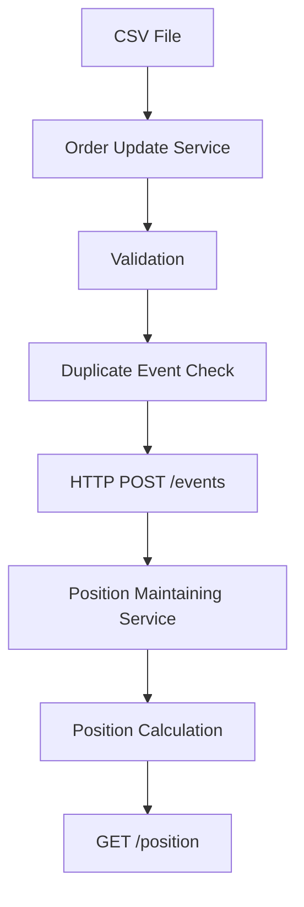

# Order Position Service

A two-service Node.js application that reads order events from a CSV file, validates and deduplicates them, sends accepted events to a Position Maintaining Service over HTTP, and maintains the current net position for each symbol.

## Architecture

The application consists of two independent services:

1. **Order Update Service**
2. **Position Maintaining Service**

### System Flow



### End-to-End Flow

```text
CSV File
   ↓
Order Update Service
   ↓
Validation
   ↓
Duplicate Event Check
   ↓
HTTP POST /events
   ↓
Position Maintaining Service
   ↓
Position Calculation
   ↓
GET /position
```

---

## Order Update Service

### Responsibilities

- Read order events from CSV.
- Validate incoming events.
- Reject invalid events.
- Handle duplicate event IDs.
- Process events in CSV order.
- Send accepted events to the Position Maintaining Service.
- Apply a configurable **50 events/second throttle**.

### Validation Rules

An event is valid when:

- `event_id` is present.
- `symbol` is present.
- `transaction_type` is either `BUY` or `SELL`.
- `quantity` is a positive integer.

Invalid events are rejected.

For duplicate `event_id`, the **first valid event wins**.

---

## Position Maintaining Service

### Responsibilities

- Receive accepted events through HTTP.
- Maintain net position for each symbol.
- `BUY` increases the position.
- `SELL` decreases the position.
- Allow negative positions.
- Ignore duplicate event IDs.
- Return current positions through `/position`.

---

## API Endpoints

### `POST /events`

Receives an accepted order event.

**Request:**

```json
{
  "event_id": "evt-1000",
  "symbol": "RELIANCE",
  "transaction_type": "BUY",
  "quantity": 100
}
```

**Example response:**

```json
{
  "message": "Event processed successfully"
}
```

> The exact response body should match the implementation in `position-service`.

---

### `GET /position`

Returns the current net position of every symbol.

**Example response:**

```json
{
  "RELIANCE": 100,
  "TCS": -50
}
```

---

## Project Structure

```text
order-position-service/
│
├── README.md
│
├── order-update-service/
│   ├── package.json
│   ├── order_updates.csv
│   ├── src/
│   │   ├── csvReader.js
│   │   └── validator.js
│   └── tests/
│       └── validator.test.js
│
└── position-service/
    ├── package.json
    ├── src/
    │   ├── index.js
    │   └── positionManager.js
    └── tests/
        ├── positionManager.test.js
        └── positionApi.test.js
```

---

## Installation

### 1. Order Update Service

```bash
cd order-update-service
npm install
```

### 2. Position Maintaining Service

Open a second terminal:

```bash
cd position-service
npm install
```

---

## Running the Application

The **Position Maintaining Service must be started first** because the Order Update Service sends events to it over HTTP.

### Step 1: Start Position Maintaining Service

```bash
cd position-service
node src/index.js
```

The service runs on:

```text
http://localhost:3001
```

### Step 2: Start Order Update Service

In another terminal:

```bash
cd order-update-service
node src/csvReader.js
```

The Order Update Service reads the CSV file, validates each event, removes duplicates, and sends accepted events to the Position Maintaining Service.

---

## Testing

### Order Update Service

```bash
cd order-update-service
npm test
```

### Position Maintaining Service

```bash
cd position-service
npm test
```

### Test Coverage

The implementation includes tests for:

- Valid `BUY` orders
- Valid `SELL` orders
- Invalid transaction types
- Zero quantity
- Negative quantity
- Non-integer quantity
- Blank quantity
- Blank event ID
- Blank symbol
- Multiple symbols
- Duplicate event IDs
- Zero net position
- Negative net position
- `GET /position` API

### Test Results

Update this section with the actual results after running the test suites:

```text
Order Update Service: 9/9 tests passed
Position Service: 7/7 tests passed
```

> Do not report these numbers as final until the test suites have actually been executed.

---

## Design Decisions

### In-Memory State

Positions and processed event IDs are maintained in memory using JavaScript objects and `Set`.

This keeps the implementation simple and is sufficient for the assessment. Data will be reset whenever the Position Maintaining Service restarts.

### Idempotency

A `Set` is used to store processed event IDs.

If an event ID has already been processed, the event is ignored. This prevents the same event from changing the position more than once.

### First Valid Event Wins

Duplicate detection is applied while processing the CSV sequentially.

If the same `event_id` appears multiple times, the first valid occurrence is accepted and subsequent occurrences are ignored.

### Service Communication

The two services communicate through HTTP:

```text
Order Update Service
        │
        │ POST /events
        ▼
Position Maintaining Service
```

This keeps both services independent and makes the Position Maintaining Service reusable by other clients.

### Sequential Processing

CSV events are processed sequentially in their original order.

This ensures that the position calculation follows the order of events in the input file.

### Throttling

A `20ms` delay is used between events.

This corresponds to a maximum processing rate of approximately:

```text
1000ms / 20ms = 50 events/second
```

---

## Example Position Calculation

Suppose the following events are received:

```text
BUY  RELIANCE 100
SELL RELIANCE 40
```

The calculation is:

```text
RELIANCE = +100
RELIANCE = +100 - 40
RELIANCE = 60
```

Result:

```json
{
  "RELIANCE": 60
}
```

### Negative Position Example

A `SELL` order is allowed to make the position negative.

For example:

```text
SELL TCS 50
```

Result:

```json
{
  "TCS": -50
}
```

---

## Error Handling

The Order Update Service rejects events that do not satisfy the validation rules.

Examples of rejected events:

```text
Missing event_id
Missing symbol
Invalid transaction_type
Zero quantity
Negative quantity
Decimal quantity
Blank quantity
```

Rejected events are not sent to the Position Maintaining Service.

---

## Idempotency Example

If the following events are received:

```text
evt-1000 | RELIANCE | BUY  | 100
evt-1000 | RELIANCE | BUY  | 100
```

Only the first event affects the position.

Final position:

```text
RELIANCE = 100
```

The duplicate event is ignored.

---

## Technologies

- **Node.js** — Runtime
- **Express.js** — HTTP server
- **Axios** — HTTP communication
- **Jest** — Unit testing
- **Supertest** — API testing
- **CSV Parser** — CSV file processing

---

## API Testing with cURL

### Send an Event

With the Position Maintaining Service running:

```bash
curl -X POST http://localhost:3001/events \
  -H "Content-Type: application/json" \
  -d '{
    "event_id": "evt-1000",
    "symbol": "RELIANCE",
    "transaction_type": "BUY",
    "quantity": 100
  }'
```

### Check Current Positions

```bash
curl http://localhost:3001/position
```

Example:

```json
{
  "RELIANCE": 100
}
```

---

## Complete Execution Flow

```text
1. Start Position Maintaining Service
              ↓
2. Position service starts on port 3001
              ↓
3. Start Order Update Service
              ↓
4. CSV file is read sequentially
              ↓
5. Each event is validated
              ↓
6. Duplicate event IDs are ignored
              ↓
7. Valid events are sent using POST /events
              ↓
8. Position service updates the symbol position
              ↓
9. Processing continues at max ~50 events/second
              ↓
10. GET /position returns the final positions
```

---

## Notes

- Both services currently use in-memory state.
- Restarting the Position Maintaining Service clears positions and processed event IDs.
- The Position Maintaining Service should be started before the Order Update Service.
- Event order from the CSV is preserved.
- Negative positions are intentionally supported.
- Duplicate events are handled using event IDs.

---

## Assessment Checklist

Before submitting the project, verify:

- [ ] Both services install successfully.
- [ ] Position Maintaining Service starts successfully.
- [ ] Order Update Service reads the CSV successfully.
- [ ] Invalid events are rejected.
- [ ] Duplicate events are ignored.
- [ ] Valid events reach `POST /events`.
- [ ] BUY increases position.
- [ ] SELL decreases position.
- [ ] Negative positions work correctly.
- [ ] `GET /position` returns the expected result.
- [ ] All Jest tests pass.
- [ ] API tests pass.
- [ ] Final integration test has been completed.
